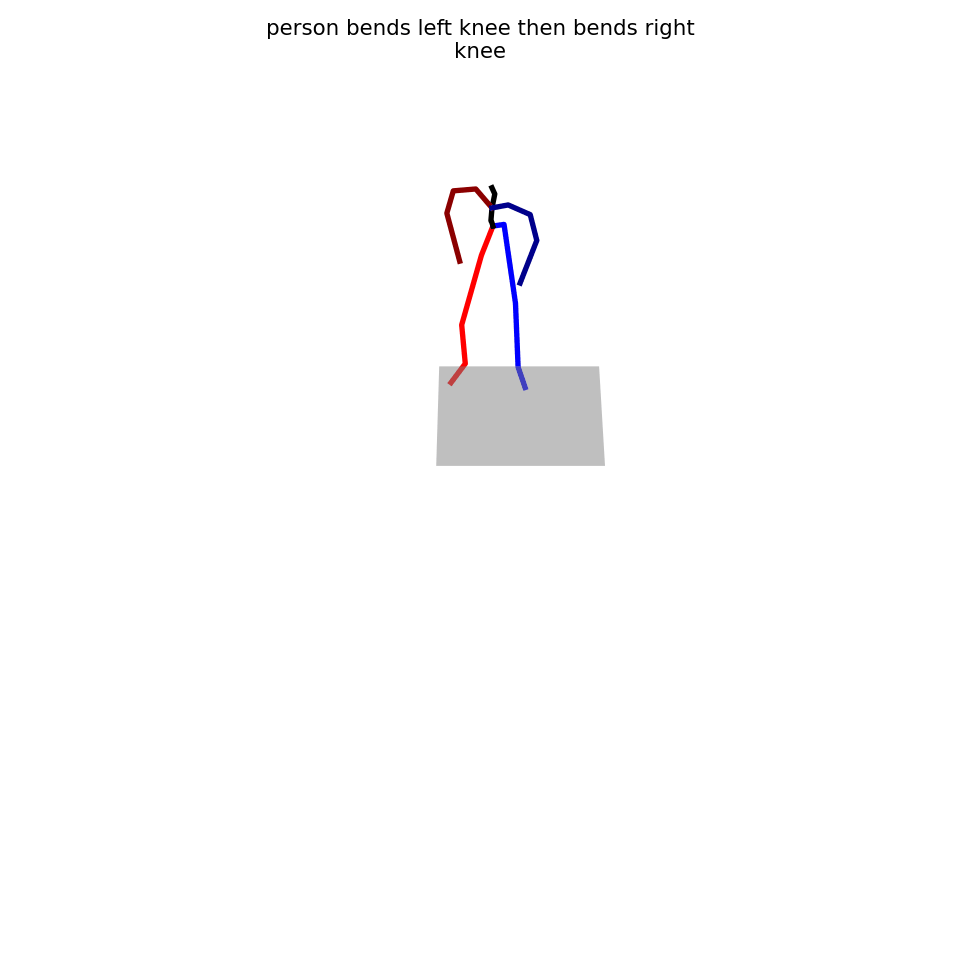
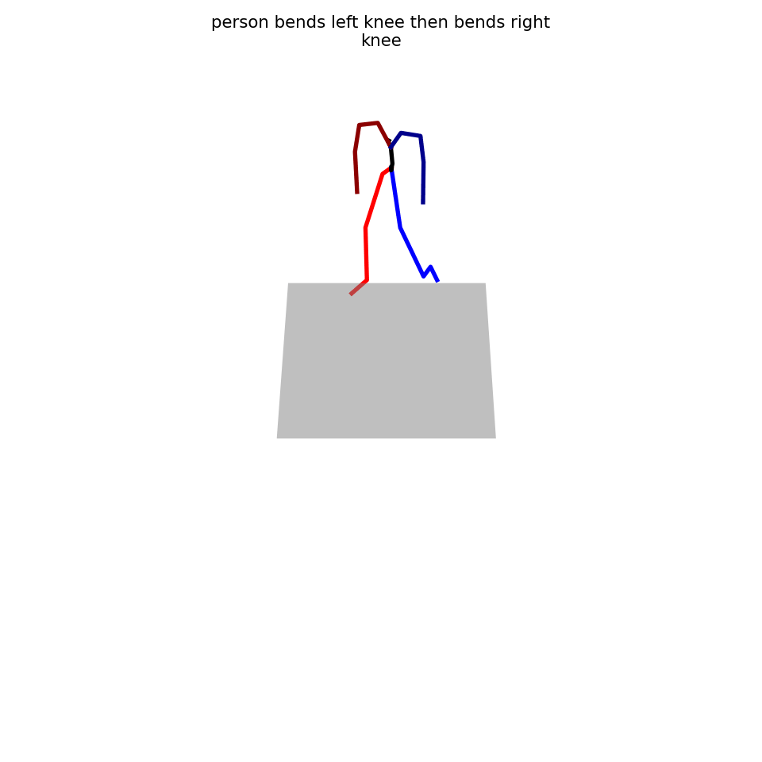
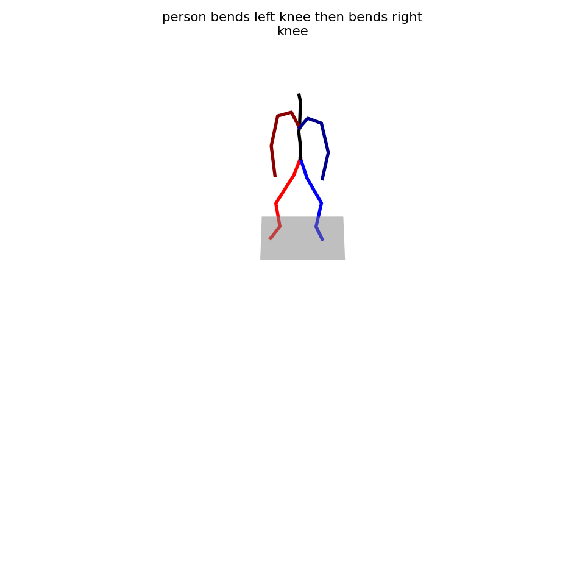

# Sequential Text-to-Motion Generation

## Project Summary
ParCo(Part-Coordinating Text-to-Motion Syenthesis)는 텍스트로부터 사람의 동작을 생성하는 모델이다. 이 모델은 전신 모션을 6개의 part(오른팔, 왼팔, 오른 다리, 왼 다리, 척추, 중심)로 세분화하여 학습한다. 각 파트마다 별도의 경량 생성기를 사용해 모션을 생성하며 Part Coordination 모듈을 통해 모션을 조율하여 더 자연스러운 모션을 생성한다.

하지만 ParCo는 "raise left hand and kick the door with right foot"과 같이 순차적인 흐름이 주어질때, 행동 간 시간적 순서를 제대로 반영하지 못하는 한계를 보였다.

본 프로젝트는 이러한 ParCo의 문장 속 동작의 시간적 흐름을 제대로 반영하지 못하는 한계를 개선하는 것을 목표로 했다. 다음과 같은 실험을 통해 문장에 담긴 동작의 순서를 올바르게 반영하고, 동작의 자연스러움을 향상시키고자 하였다.

- VQ-VAE 구조에 positional embedding을 적용해 동작의 시간 흐름을 인코딩하도록 개선
- CLIP의 token-level 출력과 GRU 출력을 연결(concatenate)하여 text embedding을 구성

## Code Instruction
이 프로젝트는 ParCo(Part Coordinating Motion Synthesis)를 기반으로 하고 있다. dataset 준비, 모델 학습, 모션 생성 및 시각화 과정은 원본 ParCo의 안내를 따른다. (설치 및 실행은 아래 링크를 참고하세요)
https://github.com/qrzou/ParCo

### 본 프로젝트에서 수정한 내용:
- batch_size 64 \  로 설정
- vqvae에 postional embedding 추가 모델은 pe_train_ParCo_vq.py와 pe_train_ParCo_trans.py로 학습
- clip에 gru 추가한 transformer 모델은 train_ParCo_vq.py 파일과 train_ParCo_CLIPwithGRU.py로 학습

## Demo
<table>
  <tr>
    <td align="center">
       
      ParCo 모션
    </td>
    <td align="center">
       
      VQVAE에 PE 추가 모션
    </td>
    <td align="center">
       
      CLIP에 GRU 추가 모션
    </td>
  </tr>
</table>

## Conclusion and Future Work
기존 ParCo 모델은 문장 내 순차적 동작 정보를 충분히 반영하지 못해 부정확하거나 부자연스러운 모션을 생성했다. 본 프로젝트를 통해 VQ-VAE + Positional Embedding과 CLIP + GRU 기반 Text Encoder의 두 가지 방법을 탐색하여 ParCo의 이러한 한계를 개선하고자 했다.

특히 CLIP+GRU(Concat)은 순서 보존, 동작 완전성, 자연스러움 모두에서 가장 높은 성능을 보이며 기존 ParCo 대비 명확한 개선을 달성했음을 확인했다. 이는 의미 정보와 시간 정보의 분리 및 병합 처리 구조가 효과적이었음을 보여준다. VQVAE+PE 역시 기존 ParCo보다는 개선되었지만, 아직 완성도가 높은 수준은 아니며 결과의 불안정성과 outlier발생이 있었다. 

향후 연구에서는 다음과 같은 방향으로 진행될 수 있다.
- CLIP+GRU 버전에서 FID가 증가하여 모션의 자연스러움이 다소 떨어지는 한계가 있었으므로, 이를 개선하기 위한 추가 연구가 필요하다. VQVAE+PE의 경우 multimodal distance의 증가로 인한 일관성 부족 문제도 해결해야 한다.
- 3단계 및 시간 지시어 문장에서도 더 높은 순서 보존 및 동작 완전성을 달성하기 위한 모델 최적화가 필요하다.

